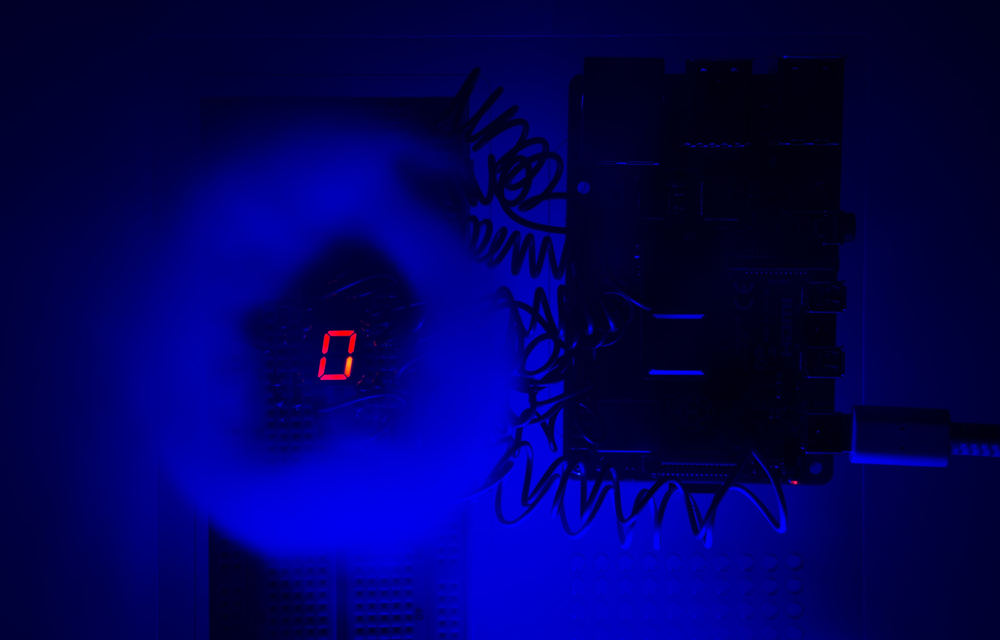

# Raspberry Pi4 Model B - Assembly language
Bare Metal coding with Assembly language on a Raspberry Pi 4 Model B


## Where the magic is happening
Everything you need to know or change is in the "./blink_sos/boot.S" file.

## Prepare your microSD Card
Headless installation with Debian

1. Download image: [Raspberry Pi OS Lite 64bit](https://www.raspberrypi.com/software/operating-systems/)
2. Write image onto microSD Card:
```bash
# extract image
unxz 2022-09-06-raspios-bullseye-arm64-lite.img.xz

# list block devices
lsblk

# Write image onto microSD Card: 'mmcblk0' replace with device for microSD Card
dd if=2022-09-06-raspios-bullseye-arm64-lite.img of=/dev/mmcblk0

# The following two partitions where created: 'boot' and 'rootfs'
```

## Create your own Assembly Image with Debian
1. `apt install git make gcc-aarch64-linux-gnu`
3. Clone the repo
4. change into the blink_sos folder
5. `make`
6. The output should look like this:
```
aarch64-linux-gnu-gcc -Wall -Wextra -nostdinc -nostdlib -fno-builtin -c -Iinclude -o boot.o boot.S
aarch64-linux-gnu-ld -o kernel.elf boot.o -Map System.map -s -T sys.ld -x
aarch64-linux-gnu-objcopy -O binary kernel.elf kernel8.img
```
8. Copy and replace the "./blink_sos/config.txt" file on the boot partition of the microSD Card (you need to do this only once)
9. Copy and replace the "./blink_sos/kernel8.img" onto your microSD among the other files in the boot partition
10. Insert the microSD into the RPi4 and give it some power
11. cross your fingers and hope it doesn't explode

## GPIO Pins
In this example I use the following GPIO-Pins: 

| GPIO Pin (output)  | LED / 7-Segment Display |
| :---: | ------------- |
| 10  | LED (green)  |
| 20  | Segment - A  |
| 21  | Segment - B  |
| 22  | Segment - C  |
| 23  | Segment - D  |
| 24  | Segment - E  |
| 25  | Segment - F  |
| 26  | Segment - G  |
| 27  | Segment - DP |

## GPIO Pinout Raspberry Pi 4 Model B


## Example Setup


## Code Structure


